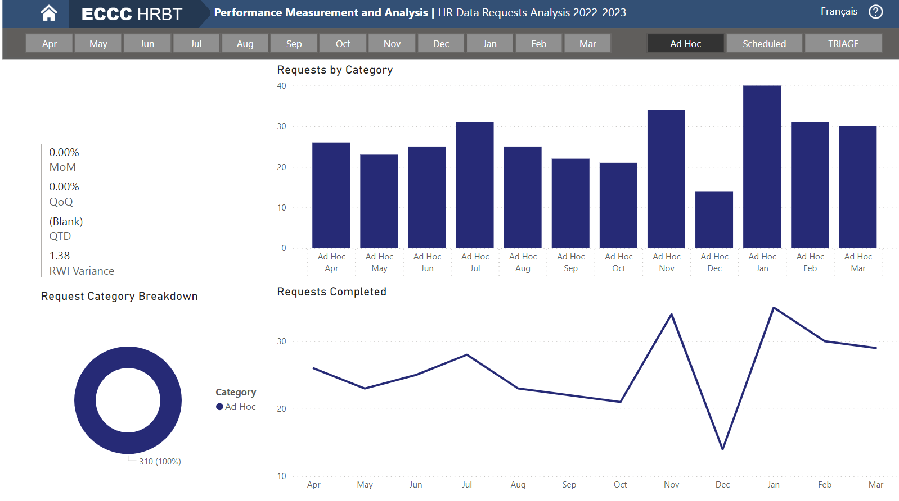

# HR Data Requests Analysis Dashboard
A Business intelligence dashboard on the Microsoft Power BI platform.

## Description
As part of a departmental action within the ECCC Performance Management branch, there is a need to analyze data requests which are submitted and processed by the department, for the purpose of business intelligence. Its main purpose is executive reporting for the fiscal year, but has use cases for multiple levels of users. In this use case, the dashboard accurately aggregated the KPIs in a single page, and was able to demonstrate evidence for the benefit of automated work process for departmental productivity, and laid a groundwork for further studies for risk assessment. 

The dashboard also covers the BI processes of:
- Performance metrics and benchmarking.
- Descriptive analytics
- Statistical analysis
- Data visualization and visual analysis

It allows users access to self-service of querying, analytics, and testing data-specific questions, with speed to insight. The data produced by each visual can be exported as a csv file for further analysis.

Main use cases:
- Quick executive report generation, intended for executives.
- Real-time performance and operations monitoring, intended for users in management.
- Querying of requests by slicing for categories or conditions and drilling down to individual requests, intended for operational users.
- Exporting csv files produced by visuals for further analysis, intended for analysts and developers.
- Setting up dynamic refreshing of the data source or embedding the dashboard in a web application or secure portal, intended for developers and database administrators.

## Data Sources
All data is sourced from the internal database, which is collected from Axios Assyst. The data file as a part of this demo is anonymized.

## Key Metrics
The key metrics for the report were data requests for the 2022 fiscal year. The common dimensions available in the report include request categories, which are Ad-hoc, Scheduled, and Triage.

## Features

### Report/Executive Summary
Shows a bar chart visual for the following:
- Requests by Branch
- Top 5 Requesting Branches by Resolution Time
- Top 5 Departments by Request Count
- Top 5 Requesting Departments by Resolution Time
- Variance in Request Count
- Tasks Resolved with Automation: tasks resolved by Automation shows the % of scheduled tasks resolved out of all resolved requests for the month. Scheduled tasks are workflows assisted by automation, and demonstrate the value of technology in the business process.
- Request by Category
- Top 5 Subjects
- Top 5 Requested Product Types
- Frequency by Complexity: requests were classified by grouping assignments and closures into New Requests, and all others into Request Updates. Products which have high average resolution times relative to the others are classified as Complex, and the others are Simple.
- Frequency by Category
- Requests by Tier
- Requests by Resolution Time: requests were grouped by 5 days or less, and other.
- Resolution Time of Ad-Hoc Requests
- Ad-Hoc Correlation: shows the value of the Pearson correlation coefficient between the average resolution time of ad-hoc requests over the year and the total number of completed requests over the year.
- Number of Requests per month

### Dashboard and Navbar
All slicers and categories are synced across the dashboard and allow users to query data based on their chosen selections. Shared slicers include:
- Slicers for months (a range of months are allowed).
- Slicers for request category (Ad-hoc, Scheduled, Triage).
- MoM % change
- QoQ % change
- YoY % change
- QTD
- Treemap of branches
- Treemap of deparments
- Count of Requests by Category Cards

### Request Highlights
- Summary Table of metrics with sorting

### Index
- Requests Weighted Index
- Request Weighted Index Variance
- Requests Weighted Index MoM % waterfall Chart
- Resolved/Open % Spread MoM % waterfall chart
  
### Request Volume
- Request Category Breakdown
- Requests completed by month

### Request Type Highlights
- Requests by Resolution time

### Request Source
- Top 5 Requesting Branches by volume
- Top 5 Requesting Departments by volume
- Top 5 Requesting Branches by time
- Top 5 Requesting Departments by time

### Risk Index
If both Warnings are flashing, and the Resolved/Open % Spread MoM is positive, then it suggests a high risk month alert. Considerations are:
- The Requests Weighted Index (RWI) is calculated by taking the average of the total requests with the weights of 50% for ad-hoc, 25% for scheduled, and 25% for triage.
- The RWI MoM % is intended to represent the velocity of request volume, as it is a measure of the rate of change of the total number of requests (weighted) from month to month.
- RWI Volatility is calculated by subtracting RWI MoM % Variance by the RWI MoM % average of 3 months. It is intended to represent the amount the short term velocity of requests differs form the usual (quarterly) velocity of amount of request volume.
- Workload Spread is intended to represent the amount of workload the department is experiencing, and is the ratio between resolved and all open requests as of the month.
- Workload Volatility is intended to represent the amount the short term velocity of workload differs form the usual (quarterly) velocity of workload. It is calculated by subtracting the Workload Spread MoM % by the Workload Spread MoM % average of 3 months.

Volatility is an absolute measure, and the direction of the change should be considered. For the purpose of assessing risk, high volatility should only be a cause of concern if the volume of work and/or the Workload Spread is increasing concurrently. Due to the limitations of real-time data reporting and collection, MoM changes are not fully representative of the environment experienced by the department. The measures are a lagging indicator, but serve the purpose to provide evidence for volatile conditions experienced by the department.

The indicators and concepts suggested by this tool may be developed further and with more rigor, and used in conjunction with work capacity allocations and work structure analysis (ad-hoc average resolution time) and automation (scheduled) as a starting point to conduct forecasting studies on short term load for HR resources or labor demand.

### Requests
- Requests Matrix for drilling to specific requests: rows selected from the report are related to both records in the database and the business layer application (Axios Assyst) by unique id.

## Technologies / Requirements
- Microsoft Power BI
- Python (tested with Python 3.8)
- pytest

# Getting Started

## Installing
1. Install the .pbix file and the data.csv file.
2. Load the data into the PBI report. 
3. Publish to Power BI workspace. Alternatively, get the embed code from the report and embed into a web application.

## Usage
Quick executive report generation:
1. Filter the data for desired selections, such as range of date.
2. Have an analyst or Subject Matter Expert fill in some key insights from the aggregated visuals.
3. Export to pdf (if necessary).
4. Submit the report.

Real-time performance and operations dashboard for monitoring:
1. Navigate to desired view containing KPIs or metrics to assess. 
2. Filter the data for desired selections, such as range of date to ask a data-specific question.
3. Navigate to the request matrix view to query for specific users related to requests.

Querying of requests by slicing for categories or conditions and drilling down to individual requests:
1. Navigate to desired view containing categories or conditions of interest. 
2. Filter the data for desired selections, such as range of date to ask a data-specific question.
3. Navigate to the request matrix view to query for a specific request.

Example - Say that we are interested in Ad Hoc requests and want to get the incident reference numbers of the year (Request Type Volume Page). We would select Ad hoc from the navbar slicer, then get the query from the requests matrix. 

If we are a manager, we may be interested in the assigned user, and if we are an operational user, we may be interested in the client’s name.

Exporting csv files produced by visuals for further analysis:
1. Ensure that the data is loaded, refreshed.
2. Navigate to desired view containing categories or conditions of interest, or KPIs or metrics to assess. 
3. Filter the data for desired selections, such as range of date to ask a data-specific question.
4. Export the csv file produced by the visual for the query.

Example - Requests by category visual export

Setting up dynamic refresh or embedding to web
1. Publish the report to desired workspace.
2. Set a schedule for automatic refresh, or manually refresh the data as desired.
3. Get the export code.

## Testing
pytest unit tests have been included to test key data visuals and manipulations which most other visuals are derived from. The testing method was to compare the output data from each visual with the base dataset. To test, collect the dashboard's dataset (.csv) and the output data (.csv) from the visual you wish to test, tweak the constant names of the test to match the columns you wish to test, then run either the individual test, or all the tests in the folder with:
`` pytest ``

You can adjust the relative tolerance to find a good estimate of error, and set a range for relative accuracy for acceptance and documentation. For this dataset, the results were found to be:

Volume Tests:
- Total Requests: pass, relative tolerance 0.01
- Total Requests per Month: pass, relative tolerace 0.01

Time Tests:
- Average Resolution Time Total: pass, Relative tolerance = 0.07 Max error of 6-7%
- Average Resolution Time per Month: pass, Relative tolerance = 0.35, 1/12 Fail with 0.25, 3/12 Fail with 0.2

## Acknowledgments
- My employer ECCC, for allowing me to work on this project.
- TRU's Kevin O'Neil, for being the advisor for this project. 

## License
© Copyright 2023, Junsoo Park. All rights reserved.

